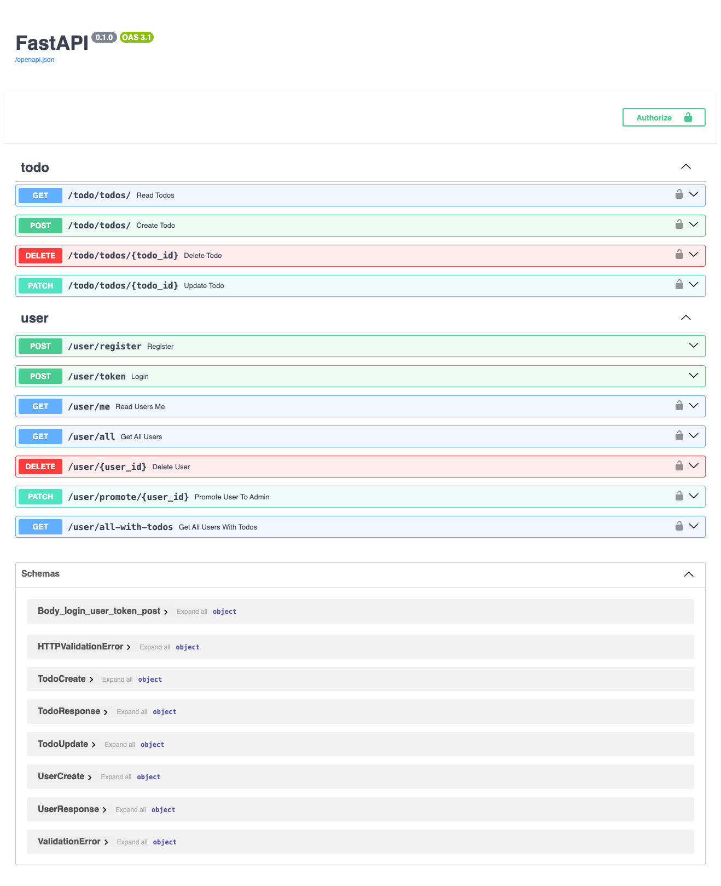

# To-Do App Backend

A robust, production-ready FastAPI backend for a multi-user to-do application with authentication, admin controls, and PostgreSQL database support. This project is designed for extensibility, security, and modern Python best practices.

## Features

- User registration and JWT-based authentication
- Admin user management (promote, delete, view all users)
- Each user can manage their own todos (add, update, delete, mark complete)
- Admins can view all users and their todos
- Alembic migrations for database schema management
- Environment configuration via `.env` and Pydantic settings
- Full test suite with pytest

## Tech Stack

- **Python 3.10+**
- **FastAPI** (API framework)
- **SQLAlchemy** (ORM)
- **Alembic** (migrations)
- **PostgreSQL** (database)
- **Pydantic** (settings & validation)
- **Uvicorn** (ASGI server)
- **Pytest** (testing)

## Getting Started

### 1. Clone the repository

```sh
git clone https://github.com/muntakim1/todo.git
cd todo
```

### 2. Set up the environment

Use Uv to create a virtual environment and activate it:

```sh
uv sync
```

### 3. Configure environment variables

Copy `.env.local` to `.env` and edit as needed:

```sh
cp .env.local .env
```

### 4. Run database migrations

```sh
alembic upgrade head
```

### 5. Seed initial data (optional)

```sh
python seed_data.py
```

### 6. Run the server with Uvicorn

```sh
fastapi run dev
```

## API Documentation

Once running, visit [http://127.0.0.1:8000/docs](http://127.0.0.1:8000/docs) for interactive API docs.

## Technical Documentation

### Architecture Overview

- **FastAPI** serves as the main web framework, providing RESTful endpoints for user and todo management.
- **SQLAlchemy** is used as the ORM to interact with a PostgreSQL database.
- **Alembic** manages database migrations.
- **Pydantic** is used for data validation and settings management.
- **JWT** is used for authentication and authorization.
- **Admin users** can manage other users and view all todos.
- **Regular users** can only manage their own todos.

### Main Modules

- `main.py`: FastAPI app entry point, router registration.
- `config/`: Environment settings and database session management.
- `Todo/model/`: SQLAlchemy models for todos.
- `user/model/`: SQLAlchemy models for users.
- `Todo/routes/`: API endpoints for todos.
- `user/routes/`: API endpoints for users and admin actions.
- `Todo/Schema/` and `user/Schema/`: Pydantic schemas for request/response validation.
- `seed_data.py`: Script to seed the database with initial data.
- `alembic/`: Database migration scripts.
- `test_app.py`: Pytest-based test suite.

### Authentication Flow

1. User registers with username, email, and password.
2. User logs in and receives a JWT access token.
3. Token is required for all protected endpoints (todos, admin actions).
4. Admins can promote users, delete users, and view all users/todos.

### Database Schema

- **User**: id, username, email, hashed_password, is_admin
- **Todo**: id, title, description, completed

### Adding a New Feature

1. Create or update SQLAlchemy models in `model/`.
2. Create or update Pydantic schemas in `Schema/`.
3. Add or update API endpoints in `routes/`.
4. Create a new Alembic migration and upgrade the database.
5. Add or update tests in `test_app.py`.

---

## UML Diagram (Mermaid)


---



## Contribution & Support

- Fork the repo and submit pull requests.
- Open issues for bugs or feature requests.
- For questions, contact the maintainer.

## License

MIT
